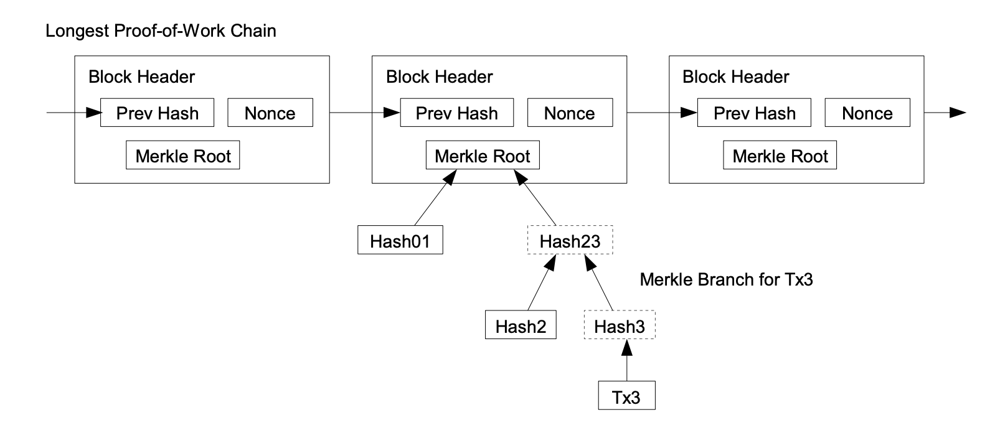
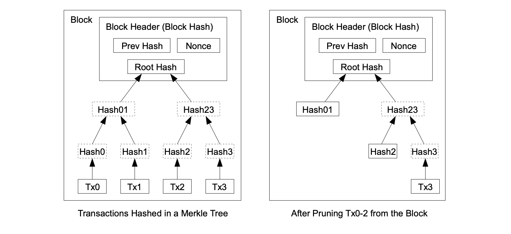

# Bitcoin Nano Network

*"Sync a Bitcoin node by downloading less than a Youtube video"*. We introduce a second-layer protocol for nodes to sync quickly. Our construction works on top of today's Bitcoin network and requires no consensus changes. All necessary constructions emerge from the existing blockchain.
In contrast to traditional light *clients* our protocol supports nano *nodes* which update and share their state. 

Nano nodes sync by downloading just about 150 MB initially. The only security assumption is that there is at least one honest peer available. If so, nodes can disprove attackers with neglectable effort.

In comparison to regular SPV clients, nano nodes provide better security and privacy. Furthermore they can serve each other and contribute to the network.

This proposal is interesting in particular for lightning network nodes that come online only once a week to watch their channels. Re-syncing is much more efficient than an initial sync.


## Overview: The Circle of Proofs
The nano network allows *nano nodes* to sync quickly.
[The most basic ideas are demonstrated by the straw-man nano node](notes/nano-network-strawman.md). 
There are four main concepts:

- An ***output path*** is simply `block_index/tx_index/output_index`. A succinct pointer to address a particular output in the blockchain. Furthermore, SPV proofs correspond to output paths. 
- The ***set of UTXO paths*** is an efficient representation for the UTXO set via output paths.
- An ***extended block*** is a regular block plus a SPV inclusion proof for every spending input.
- A ***pruned block*** is pruned down to its unspent outputs as described in Satoshi's whitepaper.

These four structures imply the *circle of proofs*:

**The old, *pruned blocks* imply the *block extensions* to prove the new blocks.**

Phrased differently:

**The old, *pruned blockchain* proves the new, *extended blockchain*.**


## Output Paths 
An *output path* is a succinct pointer to a particular output included in the blockchain. It is a very simple scheme:
```
output_path = block_index / transaction_index / output_index
```
The trivial way to prove an output path is to download the full block at `block_index`. In the following we discuss more compact proofs.

### Output Paths and SPV proofs
Since the early days Bitcoin supported SPV inclusion proofs (via Merkle roots in the block headers).

<p align="center">
  
</p>

Output paths correspond naturally to SPV proofs. This is easy to see: To verify an SPV proof one needs to know its block header within the best chain – 
this corresponds to a `block_index`. The Merkle path corresponds to a `transaction_index` and the transaction itself proves the `output_index`.

A SPV proof proves an output path's output.


#### SPV Proof Size

The size of a SPV proof is about:
```
= log2( #TX/block ) * hash_size + avg_TX_size
= log2(3000) * 32 bytes + 256 bytes
SPV_proof_size ~ 625 bytes
```
SPV proofs for SegWit transactions are about 100 bytes more compact because they exclude all witness data from the transaction hash.

### Output Path Encoding
We can encode an output path naively by padding zeros. This results in an integer of:

```
  log2( max_chain_height * max_transactions * max_outputs) bits 
= log2( 2*10^6 * 3000 * 3000 ) bits
~ 5.5 bytes 
~ 6 bytes
```

We encode output paths such that their natural order corresponds to their chronological order. Therefore, a path's most significant bits is its block index.

**Side note:** No block can have 3000 transactions with 3000 outputs. UTXO paths do not have 6 bytes of entropy and thus compress well.

### Summary: Output Paths
Output paths have remarkable properties. Here's a short summary:

- Any output is addressable with an output path `block_index/tx_index/output_index`.
- Output paths emerge from the existing blockchain structure. They are unique and immutable.
- Output paths are only 6 bytes (uncompressed).
- Full blocks can prove output paths.
- SPV proofs can prove output paths succinctly.
- Analogously, for any *spent* output there is a spending *input path*.
- Mapping from output path to a block is simple if one knows the headers chain.
- Their natural order corresponds to their chronological order. If `path_a > path_b` then `path_a` is older.


## UTXO paths
In the following we denote an *UTXO path* to be an output path pointing to an *unspent* output.

Currently, the set of all UTXO paths would be about 
```
70'000'000 UTXOs * 6 bytes = 420 MB
```
encoded naively. 
We call this "set of all *unspent* outputs' paths" the "*UTXO paths*". 

This set is a very efficient representation of Bitcoin's UTXO set. In the following we discuss how to update and query the set of UTXO paths efficiently. Furthermore, we show how to disprove an incorrect set of UTXO paths.

### Binary Search in the UTXO paths
A user wants to query all outputs of a particular Bitcoin address within the UTXO set (i.e. to prove the next block). To do that efficiently, we can sort the set of UTXO paths by the output's recipient addresses. 
This allows for binary search within the UTXO set. Each step requires downloading an SPV proof to compare the address at the current position. 

Therefore, a naive query requires total proof data of
```
  log2(#UTXOs) * SPV_proof_size 
= log2(70'000'000) * 625 bytes 
~ 16.3 kB 
```
per address.

**Side note:** Addresses are distributed evenly and the set is sorted. So we can mostly guess a path's index to reduce the number of necessary SPV proofs per query.


### UTXO Commitments
A set of 420MB UTXO paths is still too large to sync quickly. We can split it into more handy chunks, of say 5 MB each, and merklize the set of all chunks.
To make updates more efficient, we sort the set by output age before chunking. 
This exploits the fact that old outputs are much more unlikely to get spent. The "oldest" chunk rarely gets touched at all. 

To support binary search, the output paths within each chunk are, again, sorted by the output's recipient address.
Querying outputs in recent blocks becomes cheaper and queries in old blocks are more expensive because they have to download also the older chunks.

Algorithm Summary 
- Sort the UTXO paths by time
- Chunk them into slices of ~ 5MB
- Within each chunk, sort all UTXO paths by address to support binary search
- Hash the chunks and build a Merkle tree ( in chronological order )
- The Merkle root is the UTXO commitment 

This construction results in both efficient queries and efficient UTXO commitments.

**Side note:** Chunks have a start and end block height. This reduces the entropy of the paths further and allows for even better compression.


#### Chunking Strategy 
We need a deterministic chunking strategy. A naive solution is to chunk every 1000th block. The first blocks were much more sparse though, so the first chunks would be very small and the most recent chunks would be much bigger than 5MB.

Another naive solution is to chunk every 5 MB. That has highly dynamic boundaries though, and might require to rehash all chunks every block. That is too inefficient.

We need a balancing strategy for chunks such that they are balanced and efficiently updatable. 

A more objective measure would be to chunk i.e. every n-th transaction or every n-th output. That would be static boundaries that take into account the number of outputs. Nevertheless, it cannot model that old blocks contain much fewer *unspent* outputs.

Any decent long-term compression requires some dynamic within the chunk sizes. Though we can damp the dynamic to reduce malleability. For example, a chunk size re-allocation could happen only once every 2 years at a particular block heigth.


### UTXO Commitment Updates
Suppose a nano node has synced only the longest PoW chain and the most recent UTXO commitment. To validate a next block it needs an SPV proof for every input spent in the block. Naively, for each block, that is an overhead of about:
```
  #TX/block * #outputs/TX * SPV_proof_size
= 3000 * 2 * 625 bytes / block
~ 3.75 MB / block
```
Suppose we have downloaded the SPV proofs for each UTXO consumed in the block. We denote such a set of SPV proofs as *block extension*. They prove output inclusion and imply the output paths. Then to prove an output was actually *unspent* we have to download the corresponding chunk of UTXO paths.

Assuming we have to download 2/3 of the chunks to prove all outputs of the 100 most recent blocks. Then we would have to download 280 MB of UTXO paths (uncompressed size).

Having the chunks of UTXO paths, the blocks and their inputs' SPV inclusion proofs, we can update the chunks. Thus, nano nodes can update the root UTXO commitment.
Updating old chunks only means deleting entries. Adding entries only ever happens in the newest chunk. The oldest chunk is rarely touched at all.


## Satoshi Pruning and Bridge Nodes 
In Satoshi's whitepaper the chapter "Reclaiming Disc Space" explains how to use the blocks' Merkle trees to prune the blockchain down to inclusion proofs for the UTXO set. Such *pruned blocks* are exacty what's needed to derive missing SPV proofs.
<p align="center">
  
</p>


Bridge nodes do not have to serve individual SPV proofs, but only the pruned blocks. This is only little computational overhead given the fact that old blocks are updated rarely. Also updates can happen lazily. In the worst case, a server node simply serves the raw block and let the client compute all demanded SPV proofs. A nano node can translate its queries to get served by any bitcoin node today. The degree of block pruning is irrelevant for security. The root of trust is the UTXO commitment – not the existence of an SPV proof.


## Nano Nodes 
Nano nodes mostly perform queries `output_path -> SPV_proof`. They might get as response an SPV proof, a pruned block or a raw block.
In any case, a node can reuse the full answer in its next query, or to answer other users' queries with SPV proofs to save bandwidth. 

### Resolving Conflicting Commitments
Nano nodes need to learn the UTXO commitment somehow. Ideally, there would be a consensus change to expect miners to include the current UTXO commitment in every block. Until then, we need a workaround. 

The naive solution is as follows: Nano nodes can check if all their peers believe in the same root hash. If there is a conflict, they could fall back to syncing the full chain since a trusted checkpoint. Verifying a chain of extended blocks requires no further trust.


A much more efficient algorithm to sync in case of two peers offering conflicting UTXO commitments is as follows: 

- The longest PoW chain is determined as usual. We discuss the case that both our peers believe in the same headers chain but in different UTXO commitments. 
- Download the Merkle leaves of both UTXO commitments. Suppose there are 500 chunks, that is `500*32 bytes = 16kBytes` of hashes.
- Compare the chunks' hashes and find the difference.
- Download the first chunks that are different. 
- Compare the two chunks and find the first output path that differs. 
- Ask the other node for a *spending SPV proof* for that output path. 
- Any malicious node disproves itself or aborts the protocol.

The only drawback here is that we require a *spending SPV proof* to prove a chunk's incorrectness. Yet, only very few servers have to provide all spending proofs. And the overhead to run a server for spending proofs is much less than serving the blockchain. The set of spending proofs is a map `output_path -> block_index`. Such a mapping is sufficient for a nano note to extract a spending proof from any node that serves blocks. They are requested rarely because they are relevant only in case of an attack. Their sheer availability makes an attack infeasible.

This protocol provides much better security than usual SPV clients because it requires only one assumption: There is at least one honest peer.


### Download Sizes
Suppose we are a nano node that wants to sync and prove the outputs of 10 addresses. How much data do we have to download?

Naively the download size is:

- The headers chain is about 51 MB
- The UTXO paths are 420 MB
- The SPV proofs for our query are at most a few MB

In total, 480 MB for a naive sync. 

In the following, we discuss how to compress everything down to a couple MB. Most techniques exploit the chronological order of chunks. Thus, the techniques assume we know the age of our keys roughly. It is a good idea for nano nodes to timestamp their keys such that they know how much of the chain they can skip savely.

#### Download Headers Chain
A node has to know the headers chain. The raw headers chain is `block_height * 80 bytes = 615000 * 80 bytes ~ 51 MB`.

The headers chain is compressible with a rate of about 1.77 (see [Headergolf](https://github.com/alecalve/headergolf)). This reduces the current chain down to roughly 30 MB. 

If we knew our keys age roughly, and had some trusted checkpoints, we could cut off all older headers. The compressed chain growth rate is only 2.4 MB/year. Suppose our keys are not older than 2 years. That's only 5 MB.

Theoretically, it is possible to prune the headers chain down to 1 MB with techniques like [FlyClient](https://eprint.iacr.org/2019/226.pdf). A Merkle tree for headers interoperates perfectly with output paths.

#### Download Chunks
We want to query the UTXO set. So we download the UTXO paths. We do not download all chunks, but assume we need only the 2/3 most recent UTXOs. That is uncompressed 280 MB. Let's assume the compressed size is not more than 200 MB (because of the low entropy of 6 byte paths).

What does it mean to download 2/3 of the most recent UTXOs? It assumes, all our outputs are not older than 2/3 of all outputs.
If we can narrow down that assumption, we have to download much fewer chunks. 

We can download chunks chronologically. We never have to download chunks that contain only paths which are older than our addresses. [About 50% of the UTXOs have an age of 100k blocks or less](https://eklitzke.org/an-overview-of-bitcoin-utxos). If we know our keys are not older than `100k blocks ~ 2 years` we have to download not more than 50% of all chunks. We would be down to 150 MB. Downloadable in chunks of only 5 MB.

This is the absolute worst case of an intital sync with relatively old keys. More realistic is that most people with old keys have synced their node at some point. That reduces the download significantly. In all chunks but the most recent, they only have to delete all spent outputs. The difference can be represented in a bit string of marginal size.


#### Download SPV Proofs
We perform 10 queries which requires about `10 * 16.3 kB = 163 kB` SPV proof size data. The worst case of downloading a full block to extract an SPV proof is an overhead of `1.3 MB/block`, yet if there are many nano nodes that can be circumvented almost always. Furthermore, we can reuse all proofs from previous queries for the next addresses. Moreover, we can guess an addresses' index within the set to reduce the number of queries. 


#### Download New Blocks 
As long as the node is online it listens for new blocks to update its set of UTXO paths. An extended block is about 4 MB, so we have an overhead `6 * 4 MB/h = 24 MB/h` as long as we are online. The longer we listen the fewer SPV proofs we need, because many outputs are consumed quickly, so we can extract their proofs from recent blocks.

Whenever there is no node serving SPV proofs we have to fall back to downloading full blocks to extract the SPVs proofs. This increases the overhead significantly. In the worst case we have to download `1.3 MB` for every input in the new block.
In case our connection is too weak, we can simply wait a couple seconds until nodes with stronger connections share the extracted SPV proofs.


#### Re-Sync
Re-syncing is more efficient than an initial sync. New outputs are added only to the most recent chunk. In any older chunk the only update operation is deletion. Suppose Alice wants re-sync with the help of Bob:

- Alice determines the correct headers chain and UTXO commitment as usual.
- Alice asks Bob for the hashes of all chunks
- Bob sends the hashes `#chunks * 32 bytes ~ 3.2 kbytes`
- Alice verifies that the hashes are the Merkle leaves of the UTXO commitment
- Alice computes the difference to the hashes of her last known state
- For every different chunk
  - Ask Bob for "the diff" of the chunk
  - Bob computes the sparse bit vector of all unspent UTXOs of that chunk and sends it to Alice `~ 1 MB` (see below). That is not the most compact diff, but the vector is easy to compute for Bob because he knows the UTXO paths.
  - Alice deletes every spent output path from her chunk
  - Alice hashes her resulting chunk of UTXO paths and verifies inclusion in the UTXO commitment

**Side Note** 
[The UTXO bit vector of the full blockchain is about 60 MB](notes/nano-network-strawman.md). Suppose there are about 60 chunks. That means every chunk's UTXO vector is roughly 1 MB.

#### Watching Payment Channels 
In the above re-sync scenario Alice updates every chunk. Suppose she runs a lightning network node and wants to watch her payment channels. That requires to update only the chunks which include her outputs. Suppose she remembered her output paths after creation.  Now she just wants to verify that her output paths are still included in the set of UTXO paths. The worst case is that all her channels are spread across different chunks. So even in the worst case she has to download only ~1 MB per payment channel. 

**Side Note** This scheme provides nice privacy properties because an attacker would learn only in which chunks her outputs are included. Theoretically, she can further increase the anonymity set by downloading more chunks.


## Optimizations 


#### Verifying the Total Supply
The anchor of truth for the total supply is implied by the length of the headers chain and bitcoin's reward halving function.
We can apply a series of simple integrity checks to harden our construction. The Merkle tree of chunks should be a *Merkle sum tree* such that its root commits to the total bitcoin supply. 
 - SPV proofs are sufficient to update a chunk's sum successively.
 - Any output path implies the total supply at the output's creation date. 
 - Chunks are sorted chronologically so they have static upper limits of value. 
 - Only the most recent chunk's value can increase. All older chunks' values only *decrease* over time.
 - Roughly speaking, 20% of a chunk's outputs prove 80% of its value. 
 
This results in relatively strong proofs for the total supply which are very succinct. 
