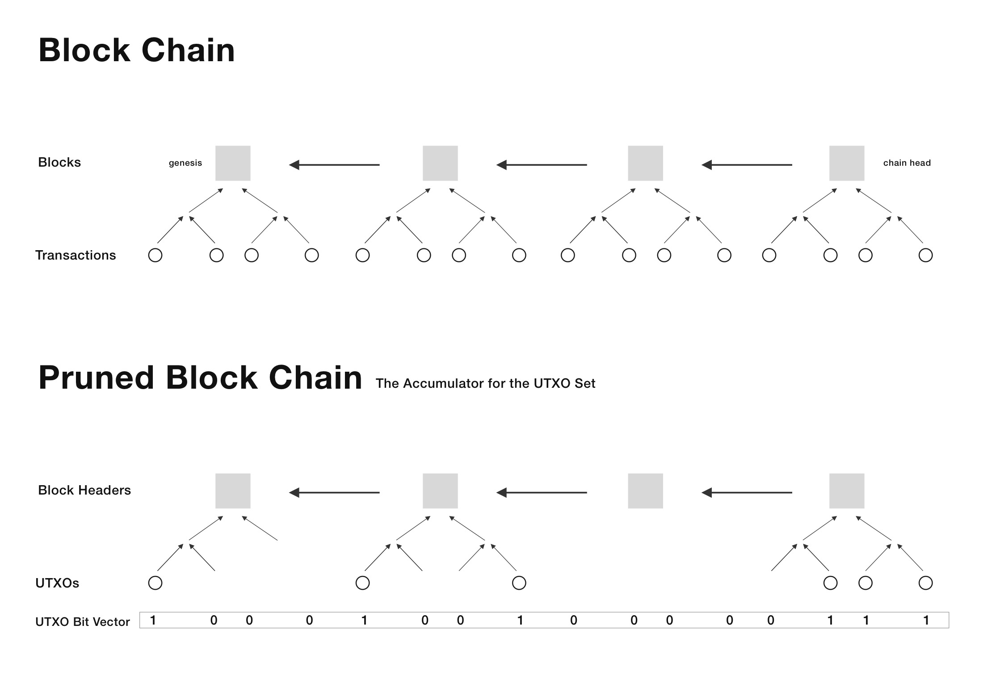

# Nano Network Straw-man

A straw-man proposal to demonstrate stateless bitcoin nodes and explain the [nano network](../bitcoin-nano-network.md). 

## Optimistic Stateless Nodes 

The blockchain is an accumulator with succinct inclusion proofs. The only problem is that our accumulator does not support deletion. Hence, we don't know if an included output is unspent.
Nevertheless, we can "extend" blocks with SPV proofs for every input consumed in the block. Such an extension reduces already the required knowledge to verify a block significantly. Our uncertainty is only 1 bit per output in the chain.

Now suppose we had a huge bit vector storing the spent-ness of every output. That vector is roughly `chain_height * max_txs_per_block * max_outputs_per_tx bits ~ 600 GB`. However, it is very sparse because there are only ~70 million unspent outputs. Its entropy is just about 160 MB. There are simple data structures to efficiently update a sparse and compressed bit vector.

That's all. Stateless full nodes are possible with just two simple components:
- Blocks extended with SPV proofs
- A bit vector for the spent-ness of every output

The most basic syncing protocol is as follows:
1. Ask all your peers for the bit vector hash they believe in
    1. If there is a conflict, fall back to sync like a regular full node
2. Otherwise, download and verify the headers chain and the bit vector
3. Start listening for new extended blocks. On every block:
    1. Update your bit vector using the SPV proofs
    2. Re-hash the vector

If there is one honest peer available, this provides full node security.

### Analysis 
This straw-man proposal kinda works though it is not very efficient. Such nodes cannot extend blocks themselves. 
Additionally, they always have to work with the full vector of 160 MB. 
Furthermore, in case of only one malicious actor, everyone just syncs like a full node.

### Comparison to Nano Nodes
The [nano network](../bitcoin-nano-network.md) refines this scheme. 
The bit vector is replaced with "*output paths*" and the "*set of UTXO paths*".
Sorting UTXO paths by the output's recipient address enables binary search. This way, stateless nodes can extend blocks themselves with the help of regular nodes serving regular blocks. Also stateless nodes can disprove attackers succinctly.
The final goal is to reduce the download to less than a song.
